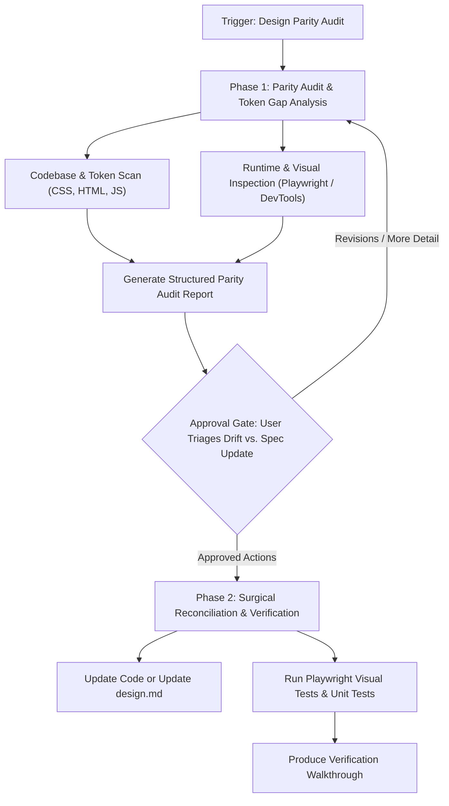

# Design Parity Auditor (`design-parity-auditor`)

The `design-parity-auditor` skill equips agents to act as hyper-critical **Design & UX Engineers**, guaranteeing that every screen, component, and token across the application remains in strict parity with the master design specification ([`design.md`](file:///design.md)).

---

## 0. Prime Directive & UX Engineering Judgement

A design system is a living contract between design intent and implementation reality. As a Design/UX Engineer, your role is not merely mechanical string-matching; it is applying **informed design judgement**:

1. **Zero Unauthorized Drift**: Every screen must visually and structurally match `design.md`. Hardcoded raw values (arbitrary hex colors, raw pixel spacings, non-spec font variations, undeclared easing curves) are treated as defects.
2. **Bilateral Judgement Engine (Code Drift vs. Spec Stale)**:
   When a discrepancy is discovered between code and `design.md`, do not blindly assume code is always wrong. Evaluate using the **Judgement Rubric**:
   - **Classification 1: Code Drift (Defect)**
     - *Cause*: Sloppy styling, copy-paste errors, forgotten hardcoded test values, or failure to reference CSS custom properties.
     - *Action*: Flag for remediation; update the stylesheet or markup to match `design.md`.
   - **Classification 2: Spec Stale (Intentional Evolution)**
     - *Cause*: A code modification was made to fix a real responsive edge case, satisfy a WCAG AA contrast failure, accommodate a browser quirk, or enhance UX on mobile viewports.
     - *Action*: Flag as an intentional evolution; propose updating `design.md` to reflect and codify the superior reality.
   - **Classification 3: Missing Token / Design System Gap**
     - *Cause*: A valid, repeated design element exists in code that has no token equivalent in Section 3, 4, or 5 of `design.md`.
     - *Action*: Propose formalizing a new token in `styles/base/variables.css` and documenting it in `design.md`.

---

## 1. Protocol Architecture: Two-Phase Workflow

To prevent unintended layout shifts or breaking visual regressions, the parity auditor enforces a mandatory two-phase lifecycle:



---

## Phase 1: Critical Parity Audit & Reporting

### Step 1.1: Scope Definition
Identify the audit targets:
- **Global Tokens**: `styles/base/variables.css` vs. Section 3 (Color Tokens), Section 4 (Typography), and Section 5 (Spacing) of `design.md`.
- **Component Prop Specs**: Machine-readable prop & attribute contracts in `specs/components/*.spec.json` (`brand-button`, `popover-dialog`, `contact-link`, `job-accordion`, `lab-card`).
- **Target Screens**:
  - Home (`index.html`) — Hero bio, brand popovers, contact links, footer.
  - Resume (`resume.html`) — Section landmarks, `<details class="job">` exclusive accordions, date badges.
  - Lab (`lab.html`) — Grid layout, iframe cards, squircle borders, motion triggers.
  - Pattern Library (`pattern-library.html`) — The canonical showcase of tokens, buttons, and popovers.
- **Component Modules**: `styles/components/*.css`, `styles/layout/*.css`, `styles/base/*.css`.

### Step 1.2: Parity Audit Checklists

#### A. Design Tokens & Value Mapping
- [ ] **Color Tokens**: Check that every color matches Section 3.1:
  - Tokens: `--white-1`, `--white-2`, `--black-1` to `--black-5`, `--gray-1`, `--gray-2`, `--blue-1` to `--blue-4`, `--orange-1` to `--orange-4`, `--bkgnd`, `--color-brand`, `--link-color`.
  - Ensure modern OKLCH representations (`oklch(from ... l c h)`) are provided within `@supports (color: rgb(from white r g b))` blocks.
  - Disallow raw hex/rgb values in component files; all colors must reference `var(--token-name)`.
- [ ] **Fluid Typography System**: Cross-reference Section 4:
  - Check variable axes: `--recursive-wght` (100–1000), `--recursive-CASL` (0–1), `--recursive-MONO` (0–1), `--recursive-CRSV` (0–1), `--recursive-slnt` (-15–0).
  - Fluid clamp formulas: Root font size must align with `clamp(...)` rules.
  - Reading measure: `max-inline-size: max(48ch, 64ch)` for optimal line length.
- [ ] **Mathematical Spacing Scale**: Section 5:
  - Spacers: `--xxs` (0.125rem / 2px), `--xs` (0.25rem / 4px), `--s` (0.5rem / 8px), `--m` (1.0rem / 16px), `--l` (1.25rem / 20px), `--xl` (1.5rem / 24px), `--xxl` (2.0rem / 32px), `--xxxl` (3.0rem / 48px).
  - Disallow arbitrary `margin`, `padding`, or `gap` values (e.g., `margin: 18px` or `padding: 13px`) that do not snap to the scale.

#### B. Modern CSS Standards & Quality Rules
- [ ] **Baseline 2025 Logical Properties**:
  - Replace physical properties (`width`, `height`, `left`, `right`, `top`, `bottom`) with logical equivalents (`inline-size`, `block-size`, `inset-inline`, `inset-block`).
  - Margins and paddings must use `margin-inline`, `padding-block`, etc.
- [ ] **Float Formatting**:
  - Check for preceding zeros on floats. Ensure values are written as `.5`, `.66`, `.125` instead of `0.5`, `0.66`, `0.125`.
- [ ] **Cascade Layers (`@layer`)**:
  - Ensure all component and layout styles belong to their respective cascade layers (`base`, `layout`, `components`, `utilities`) declared in `styles/main.css`.
- [ ] **CSS Nesting**:
  - Verify clean, standard CSS nesting without redundant ancestor repetition.

#### C. Component Architecture & Interactive Fidelity
- [ ] **Brand Buttons & Native Popovers** (Section 6.1):
  - Must use native `<button type="button" class="brand" popovertarget="...">` and `<div popover class="popover">`.
  - Hover bolding: `--recursive-wght: 800`.
  - Smooth top-layer transitions utilizing `@starting-style` and `overlay: allow-discrete; display: allow-discrete;`.
  - Sibling backdrop filter: `main:has(~ .popover:popover-open) { filter: blur(4px) opacity(.64) hue-rotate(206deg); }`.
- [ ] **Depth-Layered Contact Links** (Section 6.2):
  - Multi-tiered inset OKLCH box-shadows with timing `--link-timing: 444ms` and easing `--link-ease: cubic-bezier(.2, .8, .2, 1)`.
- [ ] **Lab Cards & Squircles** (Section 6.3):
  - Responsive container grid `minmax(200px, 1fr)` with container query units (`cqi`).
  - `@supports (corner-shape: squircle) { corner-shape: squircle; border-radius: 1.5rem; }`.
- [ ] **Resume Accordions** (Section 6.4):
  - Native `<details class="job" name="job">` with exclusive accordion behavior.

#### D. Adaptive Theming & Motion Standards
- [ ] **Light & Dark Theme Parity**:
  - Root `color-scheme: light dark;`.
  - Body background dynamically resolved using `light-dark(...)` with OKLCH color-mix in dark mode.
- [ ] **Motion & Reduced-Motion Sensitivity**:
  - All CSS transitions and animations must be wrapped or overridden with `@media (prefers-reduced-motion: reduce) { animation: none; transition: none; }`.
  - Page-to-page navigation orchestrated with multi-page View Transitions (`@view-transition { navigation: auto; }`).

#### E. Inclusive Accessibility (WCAG 2.0 / 2.1 AA)
- [ ] Color contrast: Minimum 4.5:1 for normal text, 3:1 for large text across both light and dark modes.
- [ ] Focus states: Clearly visible focus ring (`--orange-2` or high-contrast outline) on all interactive elements.
- [ ] Minimum touch targets: Interactive elements have minimum `44px` inline and block dimensions on touch devices.

---

### Step 1.3: Visual & Runtime Verification Tools
To inspect live behavior and prevent perceptual drift:
1. **Automated Token & Component Contract Audit**:
   ```sh
   node .agents/skills/design-parity-auditor/scripts/audit-parity.js
   ```
2. **Playwright Visual Regression**:
   ```sh
   npx playwright test tests-e2e/visual.spec.js
   ```
3. **Chrome DevTools MCP Inspection**:
   - Navigate to page: `navigate_page({ url: "http://localhost:5173/..." })`
   - Evaluate computed styles:
     ```js
     window.getComputedStyle(document.querySelector('.brand')).getPropertyValue('--recursive-wght')
     ```
   - Check contrast and layout dimensions using `take_screenshot` or `evaluate_script`.

---

### Step 1.4: Compile Structured Design Parity Audit Report

Format findings clearly with explicit UX engineering judgements:

````markdown
# Design Parity Audit Report: [Target Screen / Scope]
**Audit Timestamp:** [YYYY-MM-DD HH:MM:SS]
**Spec Reference:** `design.md`
**Status:** Audit Complete — Awaiting Triage & Approval

## Summary Matrix
- **Code Drift Issues (Defects):** [Count]
- **Spec Stale Discrepancies (Spec Update Recommended):** [Count]
- **Missing Token / System Extension:** [Count]
- **Baseline 2025 / Rule Compliance:** [Count]

---

### Finding [PARITY-01]: [Descriptive Title]
- **Category:** [Code Drift | Spec Stale | Missing Token | Baseline Rule]
- **Location:** `styles/base/variables.css:L25`
- **Spec Reference:** `design.md` Section 3.1
- **Code Value:** `hsla(30 60.7% 58% / 0.66)`
- **Spec Value:** `hsla(30 60.7% 58% / .66)`
- **Visual / UX Impact:** Preceding zero violates code quality rule; potential token mismatch.
- **Judgement & Recommendation:**
  - **Verdict:** [Code Drift | Update Spec | Token Extension]
  - **Rationale:** [Explanation of why code or spec should adapt]
  - **Proposed Action:**
```diff
- --orange-1: hsla(30 60.7% 58% / 0.66);
+ --orange-1: hsla(30 60.7% 58% / .66);
```
````

---

### Step 1.5: Mandatory Approval Gate

> [!IMPORTANT]
> **STOP AND SOLICIT APPROVAL.**
> The auditor MUST NOT modify code or update `design.md` until the user reviews the findings and approves the proposed verdict (Code Drift vs. Spec Update) for each item.

---

## Phase 2: Surgical Reconciliation & Verification

*Only proceed after user approval is granted.*

### Step 2.1: Execute Reconciliations
- **For Code Drift**: Update CSS files, templates, or scripts to align with `design.md`. Maintain cascade layer discipline and Baseline 2025 rules.
- **For Spec Stale Updates**: Update `design.md` with precision, updating token tables, code blocks, or component documentation to match validated real-world requirements.
- **For Token Extensions**: Add new semantic variables to `styles/base/variables.css` and document their role in `design.md`.

### Step 2.2: Automated & Visual Regression Testing
Run the complete regression suite:
```sh
npm test
npx playwright test tests-e2e/visual.spec.js
npm run lint
```
If an intentional visual change was approved, update the Playwright visual regression snapshots:
```sh
npx playwright test tests-e2e/visual.spec.js --update-snapshots
```

### Step 2.3: Verification Walkthrough
Produce a clear walkthrough artifact detailing:
- Resolved `[PARITY-XX]` items.
- Diffs of modified CSS/HTML files and `design.md`.
- Visual regression test results.
