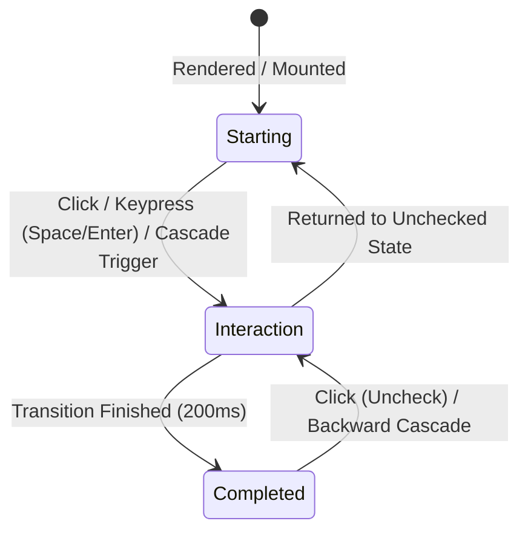

**Before starting, make sure you have read the /AGENTS.md & file for general guidelines and best practices.**

# Email Confirmation & Store Checkout Specification

This document serves as the master technical and design specification for the email confirmation pages and checkout progression components located in `/lab` (`google-store-checkout.html`, `checkout-tracking-card.html`, `google-store-checkout-truck.html`, `google-store-checkout-timeline.html`, and `store-checkout-selector.html`).

---

## 1. Core Architecture & Component Instantiation

### Architectural Philosophy
The checkout and order confirmation system demonstrates the evolution of transactional messaging—transforming a static email notification into a rich, interactive state machine without relying on external UI libraries or heavyweight frameworks.

### The Instantiation Pattern (`StoreCheckoutSelector.js`)
A fundamental principle of this architecture is that **components are instantiated from their canonical originals**:
- Rather than maintaining duplicate markup or sandboxing slides inside `<iframe>` tags, `scripts/lab/StoreCheckoutSelector.js` renders each slide by programmatically instantiating the exact native DOM structures and styling classes from the original standalone pages:
  - **Slide 1 (`v1`)**: Instantiated from `lab/google-store-checkout-timeline.html` (`createTimelineSlide`).
  - **Slide 2 (`v2`)**: Instantiated from `lab/google-store-checkout-truck.html` (`createTruckSlide`).
  - **Slide 3 (`tracking-card`)**: Instantiated from `lab/checkout-tracking-card.html` (`createTrackingCardSlide`).
  - **Slide 4 (`email`)**: Instantiated from `lab/google-store-checkout.html` (`createEmailSlide`).
- **DOM & Lifecycle Parity**: Event bindings (such as `wireCascade`), CSS Custom Properties, and state transitions remain identical across both isolated lab environments and the carousel selector stage.
- **View Transitions Integration**: Carousel transitions between instantiated slides are powered by native `document.startViewTransition()` with sibling-index CSS staggering.

---

## 2. Page Breakdown

### Variant 1: Pure CSS Checkout Timeline (`google-store-checkout-timeline.html`)
- **Concept**: Minimalist demonstration of form-based state management without JavaScript.
- **Key Mechanics**:
  - Uses hidden and styled `<input type="checkbox">` elements.
  - Cascading progress line fill governed entirely by CSS `:has([name="..."]:checked)` selectors.
  - Linear keyframe animation (`@keyframes progress`) paused/resumed via pseudo-classes.
- **Container**: Elevated card (`.timeline-container`) centered with `place-items: center`.

### Variant 2: Delivery Truck Micro-Interaction (`google-store-checkout-truck.html`)
- **Concept**: Advanced CSS motion polish introducing dynamic offset tracking and entrance styling.
- **Key Mechanics**:
  - CSS `@starting-style` defines initial zero-scale and vertical displacement for clean mounting.
  - Registered CSS `@property --truck-position` and `--truck-offset` for hardware-accelerated interpolation.
  - Spring-physics easing curve: `cubic-bezier(0.68, -0.24, 0.265, 1.24)`.
- **Container**: Card (`.truck-container`) with custom SVG delivery truck overlay.

### Variant 3: Checkout Tracking Card (`checkout-tracking-card.html`)
- **Concept**: Standalone modular card component ready for embedding in dashboard feeds or modal dialogs.
- **Key Mechanics**:
  - CSS Container Queries (`container-type: inline-size; container-name: tracking`).
  - Adapts grid spacing, checkmark size, and date typography when container width shrinks below `450px`.
  - Floating action button (`button.reset-btn`) for replaying the multi-step animation sequence.

### Variant 4: Order Confirmation Transactional Email (`google-store-checkout.html`)
- **Concept**: Complete production-grade transactional email rendered inside an authentic Gmail web client chrome.
- **Key Mechanics**:
  - Full client chrome (`.email-client`): top appbar with search, message navigation toolbar, sender metadata, and reply actions.
  - Document canvas: Google Store branding, SVG quad-color mark, and light/dark theme toggle (`#theme-toggle`).
  - Hero banner: Package delivery confirmation, cancellation policy disclaimer, and order metadata bar with "View order details" primary CTA.
  - Embedded tracking card: Integrates the interactive timeline alongside product summary (`article.product-item`).
  - Order summary grid: 4-column responsive layout for timestamp, merchant address, shipping address, and financial breakdown.

### Variant 5: Store Checkout Selector Carousel (`store-checkout-selector.html`)
- **Concept**: Interactive evolution carousel showcasing the four variants.
- **Key Mechanics**:
  - Zero-iframe native DOM instantiations of Variants 1–4.
  - Keyboard navigation (`ArrowLeft`, `ArrowRight`, `Home`, `End`).
  - View Transitions API integration with `tablist` pagination and ARIA live announcements.

---

## 3. Component Hierarchy & Taxonomy

The email confirmation ecosystem decomposes into individual and shared components:

```
specs/components/
├── [Shared Core Components]
│   ├── checkout-checkmark.spec.json       # Interactive circular checkbox & SVG/CSS checkmark glyph
│   ├── checkout-timeline.spec.json        # 7-column progress timeline & :has() connector lines
│   ├── checkout-truck-animation.spec.json # Spring-eased SVG delivery truck & @starting-style
│   ├── checkout-tracking-card.spec.json   # Container-query-driven shipment card surface
│   └── checkout-replay-button.spec.json   # Floating circular replay action button
└── [Email Page Components]
    ├── email-client-frame.spec.json       # Gmail appbar, search input, message toolbar & reply bar
    ├── email-document-header.spec.json    # Google Store quad-color logo & light/dark theme toggle
    ├── email-hero-status.spec.json        # Hero headline, package status icon, order meta & CTA
    ├── email-product-item.spec.json       # Product thumbnail media, highlighted title, price & qty
    └── email-order-summary.spec.json      # 4-column summary grid & financial balance sheet
```

---

## 4. Deep Dive: Checkmark Interaction Specification

The checkmark is the primary interactive element signaling delivery progression. It operates across three distinct lifecycle states:



### 1. Starting State (Initial / Unchecked / Idle)
- **Visual Presentation**:
  - Outer Circle: `inline-size: 1.5rem`, `block-size: 1.5rem` (`1.25rem` under `@container tracking (max-width: 450px)`).
  - Background: `var(--card-bg)` (`light-dark(oklch(from #ffffff l c h), oklch(from #303134 l c h))`).
  - Border: `2px solid var(--border-color)` (`oklch(from #dadce0 l c h)` in light mode, `oklch(from #5f6368 l c h / .5)` in dark mode).
  - Shape: `border-radius: 50%`, `display: grid`, `place-content: center`.
- **Glyph (`input::before`)**:
  - Dimensions: `inline-size: 0.7rem`, `block-size: 0.35rem` (`0.6rem` × `0.3rem` on mobile container).
  - Geometry: `border-inline-start: 2px solid oklch(from white l c h)`, `border-block-end: 2px solid oklch(from white l c h)`.
  - Transform: `rotate(-45deg) scale(0)`, with `transform-origin: bottom left`.
  - Visibility: Hidden / scaled to `0`.
- **Accessibility & Focus**:
  - `role="checkbox"`, `aria-checked="false"`.
  - Focus state: `input:focus-visible` presents `outline: 2px solid var(--checkbox-bg-color)`, `outline-offset: 2px`.
- **Pre-Checked Completed Variant**:
  - Step 1 (`#order`) is typically initialized with `checked` and `disabled`, locking it in the completed state to represent historical order placement.

### 2. Interaction State (Active / Transitioning / In-Progress)
- **Invocation Triggers**:
  - Direct pointer click or tap on `<label class="check">`.
  - Keyboard activation (`Space` or `Enter` on `<input type="checkbox">`).
  - Programmatic cascade via `wireCascade()` (clicking step 3 automatically triggers step 2).
- **Motion Physics**:
  - Glyph Expansion: `transition: 200ms transform cubic-bezier(0.4, 0.0, 0.2, 1)`.
  - Color Shift: `transition: border-color 0.2s ease, background-color 0.2s ease`.
- **Dynamic Cascade Reactions**:
  - Forward Cascade: Clicking an unselected milestone forces all preceding checkboxes to `checked = true`.
  - Backward Cascade: Unchecking an active milestone cascades forward, unchecking all subsequent checkboxes.
  - Connector Activation: Sibling `.line::after` begins expanding from `inline-size: 0%` to `100%` with `transition: inline-size 0.2s/0.3s ease`.
  - Truck Movement: Triggers transition on `.icon-wrapper--truck` towards the targeted milestone.

### 3. Completed State (Checked / Fulfilled / Active)
- **Visual Presentation**:
  - Outer Circle: `background-color: var(--checkbox-bg-color, oklch(from #1a73e8 l c h))`, `border-color: var(--checkbox-bg-color)`.
  - Glyph: `transform: rotate(-45deg) scale(1) translate(1px, 4.5px)` (or `translate(1px, 2px)` in standalone truck view).
  - High-contrast white checkmark centered inside the filled blue circle.
- **Downstream CSS Cascade Effects**:
  - Progress line preceding the step is filled via `.form-checkout:has(#step:checked) .l-step-js::after { inline-size: 100%; }`.
  - Accompanying `.step-label` and `.step-date` are displayed with high-contrast text.
  - `aria-checked="true"`.

---

## 5. Deep Dive: Delivery Truck Micro-Interaction Specification

### Architecture & Coordinate System
The delivery truck is an SVG graphic rendered inside an absolute positioning wrapper (`.icon-wrapper--truck`) that travels horizontally across the progress timeline above the connecting lines.

### Lifecycle States
1. **Starting State**:
   - Initial entrance handled by CSS `@starting-style`:
     ```css
     @starting-style {
         .icon-wrapper--truck {
             opacity: 0;
             visibility: hidden;
             transform: translateX(-50%) translateY(100%) scale(0);
         }
     }
     ```
2. **Interaction State**:
   - Movement between stages is controlled by CSS custom property `--truck-offset`:
     - Stage 1 (Preparing): `input[name="prepare"]:checked ~ .icon-wrapper--truck` -> `--truck-offset: 0px`.
     - Stage 2 (Shipping): `.form-checkout:has(input[name="ship"]:checked)` -> `--truck-offset: calc(100cqw / 7 * 2)` (or `7.5rem`).
     - Stage 3 (Delivered): `.form-checkout:has(input[name="arrive"]:checked)` -> `--truck-offset: calc(100cqw / 7 * 4)` (or `15rem`).
   - Spring Easing Curve: `cubic-bezier(0.68, -0.24, 0.265, 1.24)`.
   - Duration: `--truck-speed: .76s`.
3. **Completed State**:
   - Rests securely above the milestone checkpoint with `opacity: 1`, `visibility: visible`, and `scale(1.25)`.

### Reduced Motion Override
In compliance with WCAG 2.0 / 2.1 Principle 2:
```css
@media (prefers-reduced-motion: reduce) {
    .icon-wrapper--truck,
    .line::after {
        transition: none !important;
        animation: none !important;
    }
}
```

---

## 6. Design Tokens & OKLCH Color Matrix

The email confirmation components utilize the portfolio's W3C DTCG tokens and Google Material palette mapped into OKLCH color spaces:

| Token / Role | Light Mode Value | Dark Mode Value | Context |
| :--- | :--- | :--- | :--- |
| Surface Canvas | `oklch(from #ffffff l c h)` | `oklch(from #202124 l c h)` | Client background & page backdrop |
| Card Container | `oklch(from #ffffff l c h)` | `oklch(from #303134 l c h)` | Elevated tracking card & email sheet |
| Primary Accent | `oklch(from #1a73e8 l c h)` | `oklch(from #8ab4f8 l c h)` | Active checkmark, connecting lines, CTA |
| Border Neutral | `oklch(from #dadce0 l c h)` | `oklch(from #5f6368 l c h / .5)` | Inactive check circles, divider rules |
| Primary Typography | `oklch(from #202124 l c h)` | `oklch(from #e8eaed l c h)` | Titles, product names, price totals |
| Secondary Typography| `oklch(from #5f6368 l c h)` | `oklch(from #9aa0a6 l c h)` | Step dates, address lines, quantity |
| Brand Yellow Mark | `oklch(from #fbbc04 l c h)` | `oklch(from #fdd663 l c h)` | Highlighted `<mark>` text underline |

---

## 7. Responsive Behavior & Container Queries

- **Card Level (`@container tracking`)**:
  - `@container tracking (max-width: 450px)`:
    - Tightens 7-column grid columns to `minmax(.5rem, 1fr)`.
    - Compacts checkmark diameter to `1.25rem` (`20px`).
    - Scales step label font size to `0.75rem`.
- **Viewport Level (`@media (max-width: 600px)`)**:
  - Collapses `.order-meta` row into a vertical stack; stretches `.btn-primary` to `inline-size: 100%`.
  - Reconfigures `.product-item` to 2-row layout with inline pricing.
  - Transforms `.order-summary` from 4 columns into a single vertical stream.

---

## 8. Accessibility & Compliance (WCAG 2.0 / 2.1 AA)

1. **Accessible Names & Roles**:
   - Each checkpoint `<input type="checkbox">` contains an explicit `aria-label` (e.g. `aria-label="Order placed"`, `aria-label="Preparing shipment"`).
   - Card regions use semantic `<section>` and `<article>` tags with proper heading hierarchies (`<h1>` -> `<h2>` -> `<h3>` -> `<h4>`).
2. **Keyboard Operation**:
   - Full keyboard navigation supported across checkboxes via `Tab` and `Space`/`Enter`.
   - Distinct `:focus-visible` ring (`2px solid var(--checkbox-bg-color)` with `2px` offset).
3. **Contrast Verification**:
   - Checkmark white glyph on blue fill achieves contrast ratio `> 4.5:1`.
   - Primary text in dark mode (`oklch(from #e8eaed l c h)`) on card background (`#303134`) achieves `> 9.5:1`.
4. **Motion Sensitivity**:
   - All transitions and `@keyframes progress` animations honor `prefers-reduced-motion: reduce`.
